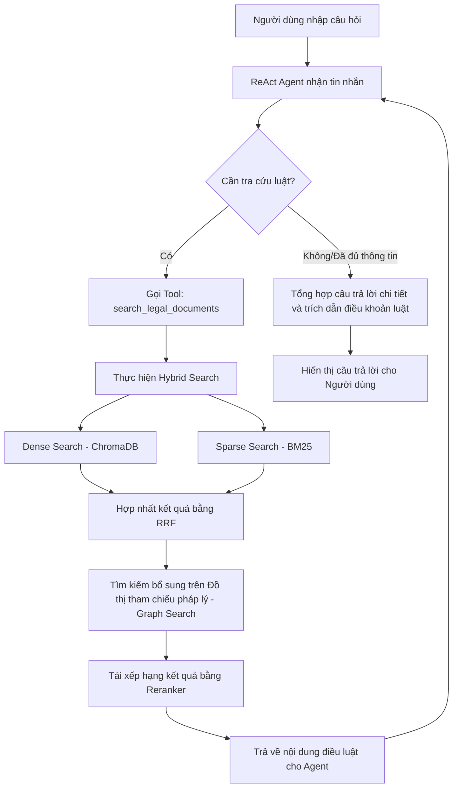

# 🏛️ Agentic Legal RAG — Trợ lý Pháp lý AI Việt Nam

Hệ thống Hỏi đáp Pháp luật (Legal Q&A) sử dụng phương pháp **Agentic RAG** (Retrieval-Augmented Generation) kết hợp mô hình ngôn ngữ lớn **Google Gemini** và quy trình truy xuất lai (Hybrid Retrieval) nâng cao dành riêng cho văn bản pháp luật Việt Nam.

Hệ thống được phát triển nhằm mục đích tra cứu thông tin nhanh chóng và chính xác từ **Bộ luật Dân sự 2015**, **Bộ luật Lao động 2019**, và **Luật Hôn nhân và Gia đình 2014**.

---

## 🚀 Tính năng nổi bật

1. **Agentic RAG (ReAct Agent)**: Sử dụng tác nhân thông minh được xây dựng bằng `LangGraph` và `LangChain`, tự động quyết định khi nào cần tra cứu dữ liệu pháp lý và tổng hợp câu trả lời dựa trên thông tin tìm thấy.
2. **Truy xuất lai (Hybrid Search)**:
   - **Dense Retrieval**: Tìm kiếm ngữ nghĩa (semantic search) bằng ChromaDB vector store và mô hình nhúng đa ngôn ngữ `sentence-transformers/paraphrase-multilingual-MiniLM-L12-v2`.
   - **Sparse Retrieval**: Tìm kiếm từ khóa (keyword search) bằng thuật toán BM25 phù hợp với các thuật ngữ pháp lý cụ thể.
   - **RRF (Reciprocal Rank Fusion)**: Hợp nhất kết quả từ Dense và Sparse Search để tối ưu thứ hạng tài liệu.
3. **Đồ thị quan hệ pháp lý (Legal Knowledge Graph)**: Sử dụng thư viện `NetworkX` để trích xuất, lưu trữ và nạp lại các tham chiếu chéo giữa các điều luật (ví dụ: "Điều X" dẫn chiếu tới "Điều Y") nhằm truy xuất thêm các điều khoản liên quan ở các bước nhảy tiếp theo (Multi-hop Retrieval).
4. **Tái xếp hạng (Reranking)**: Tích hợp Cross-Encoder có cache model để chấm điểm lại mức độ phù hợp của các điều luật với câu hỏi của người dùng trước khi đưa vào mô hình tạo câu trả lời.
5. **Giao diện Chat trực quan**: Xây dựng bằng `Gradio` hỗ trợ hỏi đáp thời gian thực với các gợi ý câu hỏi phổ biến.
6. **Đánh giá hệ thống (Benchmark)**: Script đo lường độ bao phủ từ khóa (keyword coverage) và thời gian phản hồi cho các câu hỏi kiểm thử.

---

## 📁 Cấu trúc thư mục dự án

```text
Agentic_RAG/
├── configs/
│   ├── config.yaml          # Cấu hình tham số chunking, retrieval và LLM
│   └── setting.py           # Tải cấu hình từ config.yaml & biến môi trường (.env)
├── data/
│   ├── legal_docs/          # Chứa các file văn bản pháp luật (.txt) đầu vào
│   └── chroma_db/           # Thư mục lưu trữ database của ChromaDB
├── scripts/
│   ├── ingest.py            # Pipeline xử lý dữ liệu và xây dựng index
│   └── run_benchmark.py     # Script đánh giá hiệu năng và chất lượng RAG
├── src/
│   ├── agents/
│   │   ├── orchestrator.py  # Điều phối chính, nhận câu hỏi và gọi agent
│   │   └── rag_agent.py     # Cấu hình ReAct Agent với System Prompt & Tools
│   ├── indexing/
│   │   ├── bm25_index.py    # Xây dựng và lưu trữ chỉ mục BM25
│   │   ├── chroma_store.py  # Quản lý kết nối và đẩy dữ liệu vào ChromaDB
│   │   └── embeddings.py    # Khởi tạo mô hình nhúng (Embedding Model)
│   ├── ingestion/
│   │   ├── loader.py        # Đọc dữ liệu từ file văn bản pháp luật
│   │   ├── cleaner.py       # Tiền xử lý, làm sạch văn bản tiếng Việt
│   │   └── chunker.py       # Chia nhỏ văn bản theo cấu trúc Điều/Khoản
│   ├── retrieval/
│   │   ├── dense.py         # Tìm kiếm vector bằng ChromaDB
│   │   ├── graph.py         # Xây dựng và duyệt đồ thị tham chiếu pháp luật
│   │   ├── hybrid.py        # Kết hợp Dense & Sparse search qua cơ chế RRF
│   │   └── reranker.py      # Tái xếp hạng tài liệu bằng Cross-Encoder
│   ├── tools/
│   │   └── retrieval_tools.py # Định nghĩa công cụ truy xuất cho Agent sử dụng
│   └── llm.py               # Khởi tạo kết nối Google Gemini API
├── ui/
│   └── app.py               # Ứng dụng Gradio Chat UI
├── .env.example             # File ví dụ cấu hình biến môi trường
├── docker-compose.yml       # Cấu hình chạy các dịch vụ bổ sung qua Docker
└── requirements.txt         # Các thư viện Python cần thiết
```

---

## 🛠️ Hướng dẫn cài đặt và chạy hệ thống

### 1. Chuẩn bị môi trường
Yêu cầu Python từ `3.10` trở lên. Nên tạo môi trường ảo (virtual environment) trước khi cài đặt:

```bash
# Tạo môi trường ảo
python -m venv venv

# Kích hoạt môi trường ảo
# Trên macOS/Linux:
source venv/bin/activate
# Trên Windows:
venv\Scripts\activate
```

### 2. Cài đặt các thư viện
Cài đặt tất cả các thư viện cần thiết bằng `pip`:

```bash
pip install -r requirements.txt
```

*Lưu ý: Hệ thống sử dụng thư viện tiếng Việt `underthesea` và các thư viện học máy phổ biến như `sentence-transformers` và `langgraph`.*

### 3. Cấu hình biến môi trường
Tạo file `.env` từ file `.env.example` và cấu hình `GOOGLE_API_KEY` của bạn (lấy khóa tại [Google AI Studio](https://aistudio.google.com/apikey)):

```bash
cp .env.example .env
```

Mở file `.env` vừa tạo và chỉnh sửa:
```env
GOOGLE_API_KEY=your_actual_google_api_key_here
```

### 4. Nạp dữ liệu pháp luật (Ingestion Pipeline)
Trước khi chạy ứng dụng, bạn cần nạp các tài liệu luật trong thư mục `data/legal_docs/` vào hệ thống vector store và khởi tạo các chỉ mục tìm kiếm (BM25, Graph):

```bash
python scripts/ingest.py
```

Quy trình nạp dữ liệu bao gồm:
1. Đọc các tài liệu pháp luật tiếng Việt.
2. Làm sạch và tiền xử lý văn bản.
3. Chia nhỏ văn bản theo cấu trúc từng Điều luật.
4. Lưu trữ các phân đoạn vào cơ sở dữ liệu vector ChromaDB.
5. Xây dựng chỉ mục tìm kiếm từ khóa BM25.
6. Thiết lập và lưu mạng lưới đồ thị tham chiếu pháp lý bằng NetworkX.

### 5. Khởi chạy ứng dụng Chatbot UI
Sau khi quá trình nạp dữ liệu hoàn tất, khởi chạy giao diện web Gradio bằng lệnh:

```bash
python ui/app.py
```

Sau khi chạy lệnh trên, ứng dụng sẽ khả dụng tại địa chỉ: `http://localhost:7860`. Bạn có thể mở trình duyệt và bắt đầu tương tác với chatbot pháp lý.

### Chạy bằng Docker Compose
Bạn cũng có thể chạy giao diện Gradio bằng Docker Compose:

```bash
docker compose up --build
```

Ứng dụng sẽ khả dụng tại `http://localhost:7860`.

### 6. Đánh giá chất lượng (Run Benchmark)
Bạn có thể chạy thử bộ câu hỏi kiểm thử được thiết lập sẵn để kiểm tra tốc độ trả lời và chất lượng truy xuất thông tin của hệ thống:

```bash
python scripts/run_benchmark.py
```

---

## 🏛️ Quy trình xử lý câu hỏi của Hệ thống



---

## ⚠️ Khước từ trách nhiệm (Disclaimer)
Hệ thống này chỉ là một công cụ hỗ trợ tra cứu và cung cấp thông tin tham khảo dựa trên dữ liệu văn bản pháp luật có sẵn. Thông tin do trợ lý ảo cung cấp **không thay thế** cho ý kiến và tư vấn pháp lý chuyên nghiệp của luật sư hoặc các chuyên gia pháp lý có thẩm quyền.
